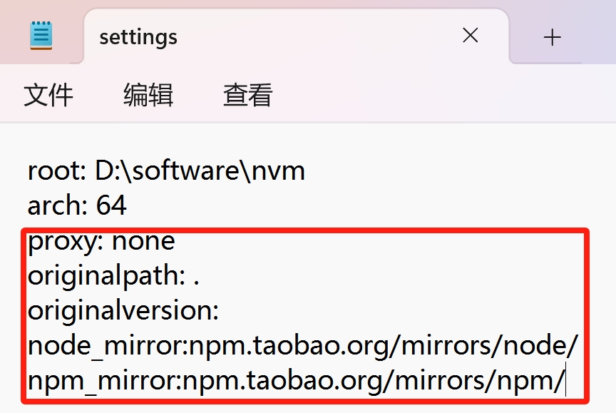

# Blog + WebVideo

### usage

1. 安装 nvm 用于安装不同版本的node.js和npm

2. 编辑nvm安装路径下的settings.txt, 配置node_mirror和npm_mirror<br>


3. nvm安装node.js和npm 
   ``` shell
   nvm install 16.20.2

   nvm use 16.20.2
   ```


5. 安装cnpm
   ```shell
   npm config set registry https://registry.npmmirror.com

   npm install -g cnpm -registry=https://registry.npmmirror.com
   ```

6. 运行项目
   ```shell
   cnpm install

   cnpm run start
   ```


***

- 后端项目地址:[webvideo](https://github.com/jingtao8a/webvideo/tree/webvideo?tab=readme-ov-file) 分支webvideo
- 前端项目参考视频:[使用React构建博客应用程序](https://www.bilibili.com/video/BV1Zg411Y7fb/?spm_id_from=333.337.search-card.all.click&vd_source=1c0783715047ed7b57030c61edf89d7b)